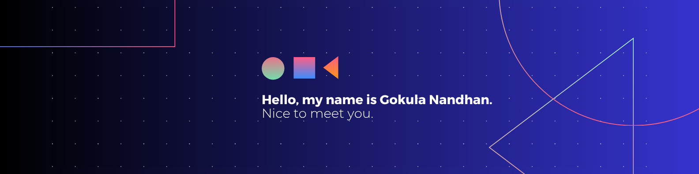

🎓 I’m a Second-year Software Engineering student at the Informatics Institute of Technology (IIT), affiliated with the University of Westminster, UK.
  💡 I have a solid foundation in software development principles and object-oriented programming.
  🤖 I'm passionate about Machine Learning, with a growing interest in:
 &nbsp;&nbsp;&nbsp;&nbsp;📊 Data analysis & model building
 &nbsp;&nbsp;&nbsp;&nbsp;📈 ML algorithms & real-world applications
  🛠️ Currently working on:
 &nbsp;&nbsp;&nbsp;&nbsp;🌍 Web applications
 &nbsp;&nbsp;&nbsp;&nbsp;🤖 ML-based tools
 &nbsp;&nbsp;&nbsp;&nbsp;🎓 Academic software systems
  🚀 I’m always open to new challenges and collaborative opportunities.
  📚 I love to learn continuously and expand my tech stack.
  🌱 Right now, I’m exploring:
 &nbsp;&nbsp;&nbsp;&nbsp;⚙️ ML frameworks: scikit-learn, TensorFlow
 &nbsp;&nbsp;&nbsp;&nbsp;🌐 Full-stack development

## 🌐 Socials:
      

# 💻 Tech Stack:
                      
# 📊 GitHub Stats:
 
 

## 🏆 GitHub Trophies

### 

<!-- top contributed repo is not showing -->
---

<!-- Proudly created with GPRM ( https://gprm.itsvg.in ) -->

